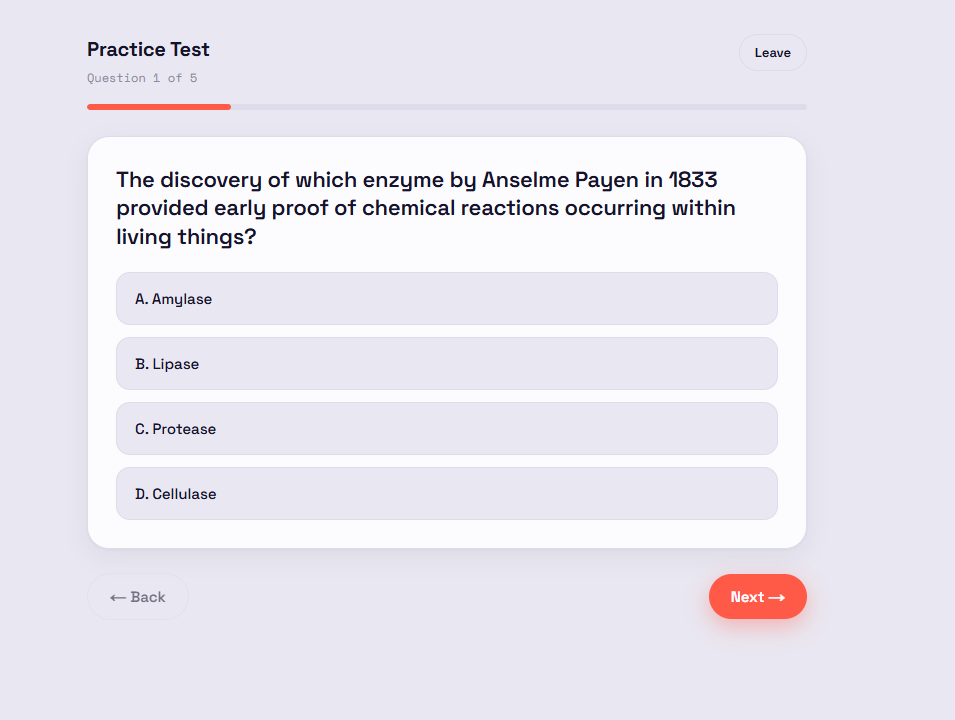

#  Circles

Study together. Quiz together.



This is a work-in-progress collaborative study platform where students can upload notes and get specialized quizzes and flashcards in return. Currently, the notes uploading and quiz/flashcard generation are already functional with set maximum sizes for each. Current features being developed are the conflict detection between notes and the live quiz feature. Future iterations will also see improved formatting, divided topics per circle, and a leaderboard feature.

## Stack

**Frontend**: Next.js 14 + TypeScript + Tailwind + Firebase Auth  
**Backend**: FastAPI + PostgreSQL + pgvector + Gemini 1.5 Flash  
**Deploy**: Vercel (frontend) + Railway (backend)

---

## How it works

1. Extracting - Once the notes are uploaded, the file type is checked to determine how to process the data. For PDFs, it scans the text layer via **pypdfium**, and if it gives less than 100 characters, it infers that it's a photo and falls back to using Optical Character Recognition (OCR) with Gemini's vision model. Image file types are also processed using the same method, while text types are decoded by UTF-8.

2. Chunking - Sliding window of 400 words per chunk and 50 word overlap is used. Overlap is added to account for facts getting cut in half between chunks. May be replaced by semantic chunking in the future.

3. Embedding - Uses gemini-embedding-001 with 768 dimensions. While 3072 is the default of the model, 768 saves us 4x the memory and gives us a faster search in exchange for a little accuracy.

4. Storage - Chunks are stored in a vector column and Hierarchical Navigable Small World (HNSW) indexing.

5. Retrieval - If a topic is provided during quiz generations, it compares the topic with the chunks belonging in the circle, and gets the k-most relevant chunks. Else, it gets an arbitrary first k-chunks. 

---

## Local setup

### 1. PostgreSQL + pgvector

```bash
# Make sure pgvector is installed
# Then create the database
createdb circles
```

### 2. Backend

```bash
cd circles-backend
python -m venv venv
source venv/bin/activate  # Windows: venv\Scripts\activate
pip install -r requirements.txt

cp .env.example .env
# Fill in your .env values

uvicorn app.main:app --reload
# Runs on http://localhost:8000
```

### 3. Frontend

```bash
cd circles-frontend
npm install

cp .env.example .env.local
# Fill in your Firebase config

npm run dev
# Runs on http://localhost:3000
```

---

## Firebase setup

1. Go to [Firebase Console](https://console.firebase.google.com)
2. Create a new project
3. Enable **Google sign-in** under Authentication
4. Copy your web app config into `.env.local`
5. In Firebase Console → Project Settings → Service Accounts → Generate new private key
6. Set `GOOGLE_APPLICATION_CREDENTIALS` env variable to the path of that JSON file (backend uses this for token verification)

---

## Rate limits

The expensive endpoints are rate limited **per authenticated user** (keyed on the
Firebase-verified DB user id, not IP) via [`slowapi`](https://github.com/laurentS/slowapi).
Exceeding a limit returns a `429` with a clear `detail` message rather than a 500.

| Endpoint | Setting | Default |
| --- | --- | --- |
| `POST /api/quiz/generate` | `QUIZ_GENERATION_RATE_LIMIT` | `10/hour` |
| `POST /api/flashcards/generate` | `FLASHCARD_GENERATION_RATE_LIMIT` | `10/hour` |
| `POST /api/notes/{circle_id}/upload` | `NOTE_UPLOAD_RATE_LIMIT` | `20/hour` |

Limits are read from `app/core/config.py` settings, so they can be retuned via
environment variables without a redeploy (values are any
[`limits`](https://limits.readthedocs.io/en/stable/quickstart.html#rate-limit-string-notation)
string, e.g. `10/hour`, `5/minute`). Set `RATE_LIMIT_ENABLED=false` to disable
rate limiting entirely (e.g. in local development).

---

## Deploy

### Railway (backend)
- Connect your GitHub repo
- Set environment variables from `.env.example`
- Railway auto-detects the `Procfile`
- When adding a new frontend domain (a Vercel preview or a custom domain), add it
  to `ALLOWED_ORIGINS` — a comma-separated list of CORS origins, each including
  the scheme (`https://…`). It defaults to the list in `app/core/config.py`, so
  setting it in Railway replaces that list rather than extending it: include the
  existing origins you still need alongside the new one.

### Vercel (frontend)
- Connect your GitHub repo
- Set environment variables from `.env.example`
- Set `NEXT_PUBLIC_API_URL` to your Railway backend URL

---

## Project structure

```
circles/
├── circles-backend/
│   ├── app/
│   │   ├── main.py                # FastAPI entry point
│   │   ├── core/
│   │   │   ├── config.py          # Settings / env vars
│   │   │   ├── firebase.py        # Auth dependency
│   │   │   └── rate_limit.py      # Per-user rate limiting (slowapi)
│   │   ├── db/
│   │   │   └── database.py        # DB pool + schema init
│   │   ├── api/routes/
│   │   │   ├── auth.py            # /api/auth
│   │   │   ├── circles.py         # /api/circles
│   │   │   ├── notes.py           # /api/notes
│   │   │   ├── quiz.py            # /api/quiz
│   │   │   ├── flashcards.py      # /api/flashcards
│   │   │   └── live.py            # WebSocket /api/live/ws
│   │   └── services/
│   │       ├── extract.py           # PDF/OCR/text extraction
│   │       ├── embedding.py         # Chunking + pgvector
│   │       ├── quiz_generator.py    # RAG + Gemini quiz generation
│   │       ├── flashcard_generator.py # RAG + Gemini flashcard generation
│   │       ├── conflict_detector.py # Cross-note conflict detection
│   │       └── storage.py           # File storage
│   ├── requirements.txt
│   └── Procfile
│
└── circles-frontend/
    ├── src/
    │   ├── app/
    │   │   ├── layout.tsx
    │   │   ├── page.tsx                     # Landing page
    │   │   ├── login/page.tsx
    │   │   ├── signup/page.tsx
    │   │   ├── dashboard/page.tsx           # Circles list
    │   │   ├── circles/[id]/page.tsx        # Circle detail (notes, quizzes, flashcards)
    │   │   ├── quiz/[quizId]/solo/page.tsx  # Solo quiz practice
    │   │   ├── quiz/[quizId]/live/page.tsx  # Live quiz room (WebSocket, WIP)
    │   │   └── flashcards/[deckId]/page.tsx # Flashcard study view
    │   ├── components/
    │   │   ├── Sidebar.tsx
    │   │   ├── BrandGlyph.tsx
    │   │   └── MiniViz.tsx
    │   └── lib/
    │       ├── firebase.ts       # Firebase init + helpers
    │       ├── api.ts            # API client + types
    │       ├── AuthContext.tsx   # Auth provider
    │       ├── circleStyle.ts
    │       └── format.ts
    └── package.json
```

## What's next

- [ ] Conflict detection service
- [ ] Live quiz room with WebSocket
- [ ] Scoreboard
